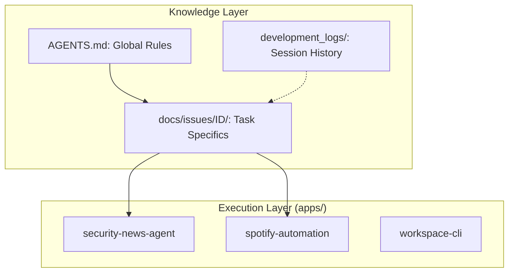

# AGENTS.md - Agent Development Guidelines

## Quick Reference

- [1. Core Mandates & Rules](#1-core-mandates--rules)
  - [1.1. Non-negotiables (Forbidden Rules)](#11-non-negotiables-forbidden-rules)
  - [1.2. Knowledge Architecture](#12-knowledge-architecture)
- [2. Technology Stack](#2-technology-stack)
- [3. Development Workflows](#3-development-workflows)
  - [3.1. Issue-Driven Development (IDD)](#31-issue-driven-development-idd)
  - [3.2. Specification Document Creation Process](#32-specification-document-creation-process)
  - [3.3. Test-Driven Development (TDD)](#33-test-driven-development-tdd)
- [4. Issue Management Guidelines](#4-issue-management-guidelines)
- [5. Commit Guidelines](#5-commit-guidelines)
- [6. Development Logs](#6-development-logs)
- [7. CI/CD Pipeline](#7-ci-cd-pipeline-githubworkflows-ciyml)
- [8. Project Architecture & Map](#8-project-architecture--map)
- [9. Operational Guidelines](#9-operational-guidelines)
  - [9.1. Git Management and .gitignore](#91-git-management-and-gitignore)
  - [9.2. Tooling and Version Management](#92-tooling-and-version-management)
  - [9.3. Quick Reference Maintenance](#93-quick-reference-maintenance)
- [10. Playwright Browser Automation Tasks](#10-playwright-browser-automation-tasks)
- [11. Self-Reflection and Self-Correction](#11-self-reflection-and-self-correction)

## 1. Core Mandates & Rules

### 1.1. Non-negotiables (Forbidden Rules)
These rules are the "Constitution" of the project. AI agents must adhere to them strictly. Violation is considered a task failure.

- **Language Policy**: All development logs (`development_logs/`), thinking processes, and reporting to the user MUST be in **Japanese**.
- **Test-First Mandate**: Never modify production code (`src/`, `scripts/`, etc.) without adding or updating corresponding tests (unit, integration, or E2E).
- **Strict Dependency Management**: Never use a library not listed in `package.json` or `pyproject.toml`. Propose additions to the user and obtain approval first.
- **No Silent Failures**: Never ignore errors from shell commands or programs. Analyze, report, and halt if necessary.
- **Strict Scope Adherence**: Never perform work outside the scope defined in `docs/issues/[ID]/`. Record discoveries as new issues instead of implementing them immediately.
- **Prefer Automation**: Always prefer automating repetitive tasks (refactoring, file moves, cleanup) via scripts or Nx Executors instead of manual execution.
- **No Hardcoded Secrets**: Use environment variables or credentials files. Never commit `.env` or API keys.

### 1.2. Knowledge Architecture
Intelligence in this workspace is managed in a hierarchical structure. Always refer to higher-level documents as the "Source of Truth."

1.  **Universal Guidelines (`AGENTS.md`)**: This file. Global rules, architecture, and forbidden actions.
2.  **Task Specifications (`docs/issues/[ID]/`)**: Task-specific "Blueprints" (`requirements.md`, `design.md`, `tasks.md`).
3.  **Audit Logs (`development_logs/`)**: The "Resume" of decisions. Historical context for *why* things were done.

## 2. Technology Stack

- **Language**: TypeScript (pnpm), Python (Poetry)
- **UI Automation**: Playwright (`@playwright/test`)
- **Package Manager**: pnpm (TS), Poetry (Python)
- **CLI**: GitHub CLI (`gh`)
- **Linter/Formatter**: ESLint, Prettier
- **CI/CD**: GitHub Actions
- **Security**: CodeQL, Dependabot, Secret Scanning

## 3. Development Workflows

### 3.1. Issue-Driven Development (IDD)
All work is managed through GitHub Issues.

0.  **Sync `main`**: Ensure local `main` is up-to-date before branching.
1.  **Issue Definition**: Define task as a GitHub Issue.
2.  **Start Development**: Run `.ops/scripts/dev-start.sh [Issue ID]` to create a branch and setup directories.
    - This script automates branching: `[type]/[issue-number]-[short-description]`.
    - It creates the documentation directory: `docs/issues/[ID]/`.
3.  **Implementation**: Follow TDD cycle.
4.  **Commits**: Link to issues (e.g., `Closes #123`).
5.  **PR/CI**: Create PR, run CI, human review.
6.  **Merge**: Approved PRs are merged into `main`.

### 3.2. Specification Document Creation Process
For every Issue, create the following in `docs/issues/[ID]/`:
- **`requirements.md`**: User stories and acceptance criteria.
- **`design.md`**: Architecture, components, interfaces, and test strategy.
- **`tasks.md`**: Checklist of atomic implementation steps.

### 3.3. Test-Driven Development (TDD)
- **Coverage**: All changes to `src/` or `scripts/` MUST have tests.
- **Red-Green-Refactor**: Write failing test -> Minimal code to pass -> Improve code/tests.
- **POM**: Use Page Object Model in `src/pages/` and reusable components in `src/components/`.

## 4. Issue Management Guidelines
- **One Issue, One PR**: Keep scope small.
- **Definition of Done**: Every issue needs a clear checklist.
- **No Scope Creep**: Create new issues for new tasks.

## 5. Commit Guidelines
- **Conventional Commits**: `<type>(<scope>): <subject>` (e.g., `feat(spotify): add login. Closes #12`).
- **Atomic Commits**: Each commit represents one logical change.

## 6. Development Logs
**注: すべての開発ログは日本語で記述されます。**
- **Location**: `development_logs/`.
- **Naming**: `YYYY-MM-DD-issue-[ID]-session-[N].md`.
- **Content**: Action summary, decisions, and rationale.

## 7. CI/CD Pipeline
GitHub Actions runs on every push/PR to `main`, performing lint, format, test, and report uploads.

## 8. Project Architecture & Map (Ideal Architecture)
This workspace follows an Nx "Apps and Libs" structure. **Any current structure that deviates from this is considered "Technical Debt" to be refactored.**

- **`apps/` (Executables & Deployables)**
    - **`agents/`**: Standalone AI agents (e.g., `security-news-agent`).
    - **`web-bots/`**: Browser automation entry points (e.g., `spotify-automation`).
    - **`tools/`**: Internal workspace CLI tools.
- **`libs/` (Reusable Modules)**
    - **`shared/`**: Cross-language utilities (AI wrappers, logging).
    - **`typescript/`**: TS-specific Page Objects, test helpers.
    - **`python/`**: Python-specific data logic, API clients.
- **`docs/issues/[ID]/`**: The Single Source of Truth (SSOT) for the current task.
- **`development_logs/`**: Records of "Why" decisions were made.

### 🚀 Placement Rules
1.  **Executable?** -> `apps/[category]/[name]`.
2.  **Shared Logic?** -> `libs/[category]/[name]`.
3.  **Workspace Automation?** -> `tools/`.

## 9. Operational Guidelines

### 9.1. Git Management
- **Strict Management**: Only commit essential files.
- **Proactive `.gitignore`**: Add generated files immediately.
- **Precise Staging**: Avoid `git add .`. Prefer `git add <file>`.

### 9.2. Tooling & Documentation
- **Official Docs**: Prioritize official documentation over assumptions.
- **Version Awareness**: Check for breaking changes in major updates.

### 9.3. Quick Reference Maintenance
- Update the Quick Reference section when headers change.

## 10. Playwright Browser Automation Tasks
- **Debugging**: Use `page.pause()` in headed mode.
- **Locators**: Prefer semantic locators (`getByTestId`, `getByRole`).
- **Stability**: Use `waitForTimeout` or `locator.waitFor` strategically.
- **Flaky UI**: Use `expect().toPass()` for retries on unstable elements.

## 11. Self-Reflection and Self-Correction
- Agents must critically evaluate their work using internal rubrics and "Chain of Thought" reasoning.
- Repeat "Plan → Execute → Evaluate → Revise" cycle until quality is met.

<!-- nx configuration start-->
<!-- Leave the start & end comments to automatically receive updates. -->

# General Guidelines for working with Nx

- When running tasks (for example build, lint, test, e2e, etc.), always prefer running the task through `nx` (i.e. `nx run`, `nx run-many`, `nx affected`) instead of using the underlying tooling directly
- You have access to the Nx MCP server and its tools, use them to help the user
- When answering questions about the repository, use the `nx_workspace` tool first to gain an understanding of the workspace architecture where applicable.
- When working in individual projects, use the `nx_project_details` mcp tool to analyze and understand the specific project structure and dependencies
- For questions around nx configuration, best practices or if you're unsure, use the `nx_docs` tool to get relevant, up-to-date docs. Always use this instead of assuming things about nx configuration
- If the user needs help with an Nx configuration or project graph error, use the `nx_workspace` tool to get any errors

<!-- nx configuration end-->