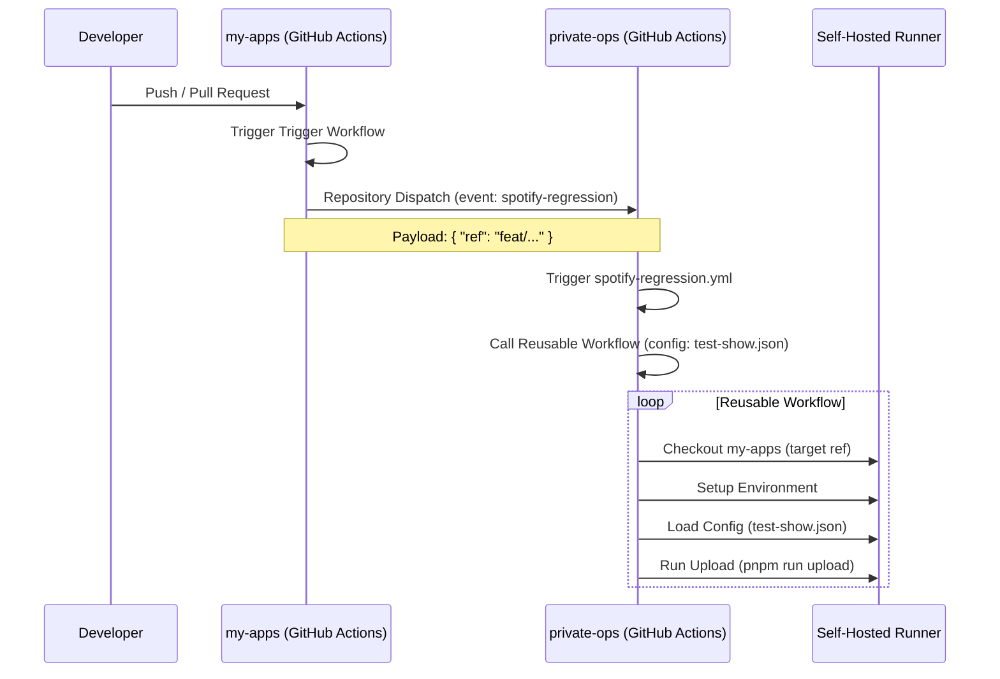

# Design: 開発環境PR/Push時のRunner環境自動リグレッションテスト構築（DRY対応）

## アーキテクチャ

本システムは、`my-apps` (開発リポジトリ) と `private-ops` (運用リポジトリ) の2つのリポジトリにまたがる GitHub Actions ワークフローで構成される。



## コンポーネント詳細

### 1. `private-ops` リポジトリ

#### A. Reusable Workflow (`.github/workflows/reusable-spotify-upload.yml`)
アップロード処理の中核ロジックをカプセル化する。

- **Inputs**:
  - `ref`: `string` (必須) - チェックアウト対象の `my-apps` の Ref (Branch/Tag/Commit)。
  - `config_file`: `string` (必須) - 使用する設定JSONファイル名。
- **Steps**:
  1. **Checkout**: `actions/checkout` を使用。`repository: centervil/my-apps`, `ref: ${{ inputs.ref }}`。
  2. **Setup**: Node.js, pnpm, ブラウザ (Firefox) 等のセットアップ。
  3. **Config Loading**: `jq` 等を用いて `config/${{ inputs.config_file }}` を読み込み、環境変数へセット。
  4. **Upload**: `pnpm run upload` を実行。

#### B. Production Workflow (`.github/workflows/spotify-automation.yml`)
既存のワークフローを改修し、Reusable Workflow を利用する形にする。

- **Triggers**: `repository_dispatch`, `workflow_dispatch` (変更なし)
- **Job**: Reusable Workflow を呼び出す (`uses: ./.github/workflows/reusable-spotify-upload.yml`)。
  - `ref`: デフォルト (通常は `main` だが、Dispatchペイロードで指定があればそれを使うロジックが必要か要検討。現状は `main` 前提であれば `main` 指定、あるいは `github.sha`)。
  - `config_file`: Dispatchペイロード (`client_payload.config_file`) または入力 (`inputs.config_file`) から渡す。

#### C. Regression Workflow (`.github/workflows/spotify-regression.yml`)
自動テスト用の新規ワークフロー。

- **Triggers**: `repository_dispatch` (types: `[spotify-regression]`)
- **Job**: Reusable Workflow を呼び出す。
  - `ref`: `github.event.client_payload.ref`
  - `config_file`: `'test-show.json'` (ハードコード)

### 2. `my-apps` リポジトリ

#### Trigger Workflow (`.github/workflows/trigger-spotify-regression.yml`)
`private-ops` へのイベント発火を担当。

- **Triggers**:
  - `push`: branches: `[main]`
  - `pull_request`: branches: `[main]`
- **Job**:
  - `peter-evans/repository-dispatch` アクション (または `gh api`) を使用。
  - **Auth**: `secrets.G_ACCESS_TOKEN` (PAT) を使用して `private-ops` へアクセス。
  - **Payload**:
    ```json
    {
      "ref": "${{ github.event_name == 'pull_request' && github.head_ref || github.ref_name }}"
    }
    ```

## 実装方針・手順

1. **`private-ops` の改修**:
   - まず `reusable-spotify-upload.yml` を作成。
   - 次に `spotify-automation.yml` をリファクタリングして Reusable Workflow を使うように変更（動作確認含む）。
   - 最後に `spotify-regression.yml` を追加。
2. **`my-apps` の実装**:
   - トリガー用ワークフローを作成。
   - `G_ACCESS_TOKEN` の存在確認（なければ追加依頼）。

## テスト戦略

CI/CD 設定自体のテストとなるため、以下の段階的検証を行う。

1. **Reusable Workflow 構文チェック**: ローカルでの Lint または GitHub Actions のバリデーション。
2. **Production Workflow 回帰テスト**:
   - 改修後の `spotify-automation.yml` を `workflow_dispatch` で手動実行（Dry Run 的な設定があればベストだが、なければ影響の少ない設定で）。
   - 既存の処理と同等のログが出力されることを確認。
3. **Regression Workflow 結合テスト**:
   - `private-ops` 側でダミーの `repository_dispatch` イベントを送信し、`test-show.json` が読み込まれて実行されるか確認。
4. **Trigger Workflow 結合テスト**:
   - `my-apps` でブランチを作成・Push し、`private-ops` 側の Action が起動することを確認。

## エラーハンドリング
- **Ref が存在しない場合**: Checkout ステップで失敗する。これは期待通りの動作（テスト対象がないため）。
- **認証エラー**: PAT の権限不足等。Workflow のログで確認。
